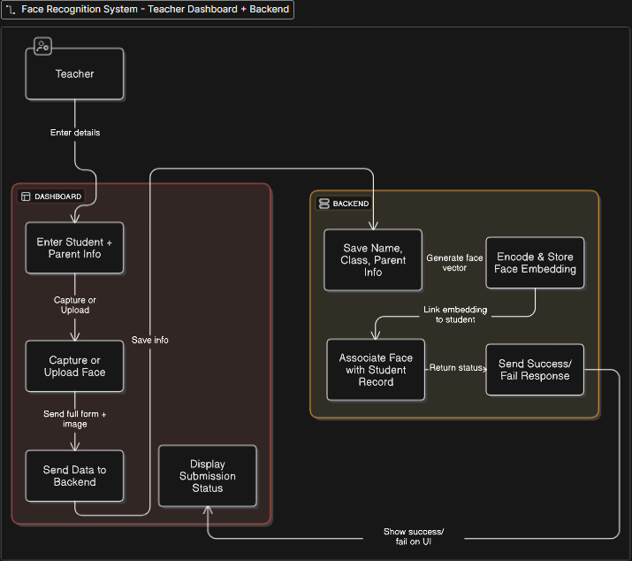
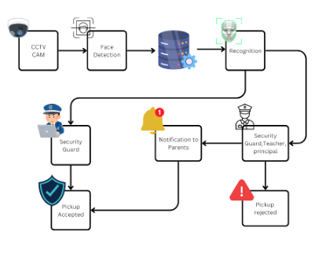

# SmartPICK: Real-Time Face Recognition for School Pickup Security

## 📌 Project Overview

**SmartPICK** is a real-time face recognition system built to enhance school pickup security. Using the ESP32-CAM module, it ensures that only **authorized persons** (like parents or guardians) can pick up students. The system is integrated with a web interface for administration and real-time notifications.

## 🎯 Problem It Solves

- Prevents unauthorized pickup of students.
- Sends real-time alerts to school staff and parents.
- Creates a trustworthy and secure environment in schools.

---

## 🛠️ Technologies Used

### 💻 Hardware
- ESP32-CAM
- FTDI Microcontroller Board
- RFID Reader (optional)

### 🧠 Software & Tools
- **Arduino IDE** (firmware upload)
- **Node.js** (backend server)
- **MongoDB** (database)
- **React.js** (frontend)
- **OpenCV** (face recognition)
- **Libraries**: dlib, Pillow, cmake, moviepy, pandas

---

## 🧱 System Architecture

## 🧱 System Flow Digram

